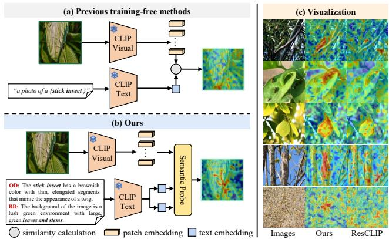
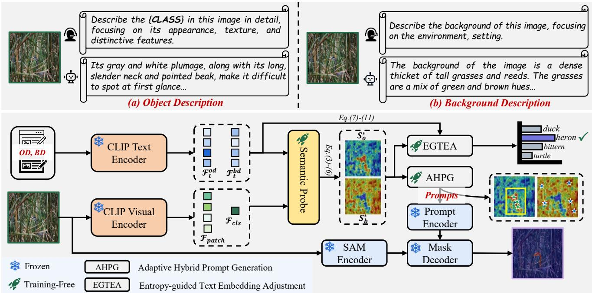
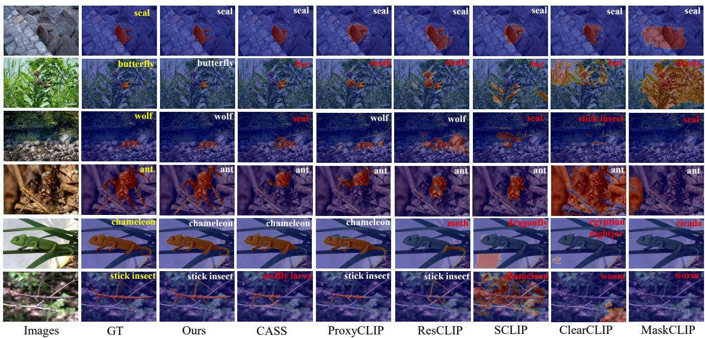
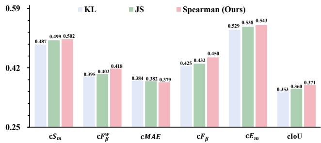
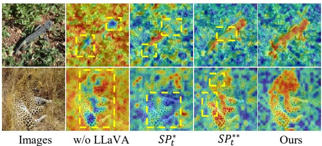
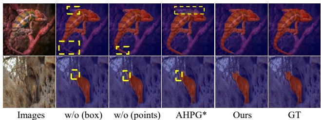
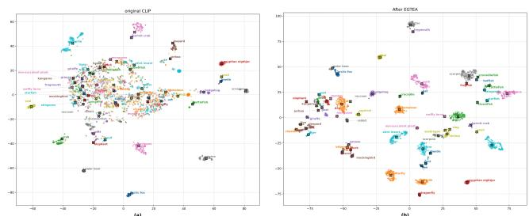

# Training-Free Open-Vocabulary Camouflaged Object Segmentation via Fine-Grained Object Binding and Adaptive Hybrid Prompt

Peng Ren $^{1,2}$ Cheng Jiang $^{1,2}$ Chuande Yang $^{1,2}$ Fuming Sun $^{3}$ Tian Bai $^{1,2*}$

$^{1}$ College of Computer Science and Technology, Jilin University $^{2}$ Key Laboratory of Symbolic Computation and Knowledge Engineering of Ministry of Education, Jilin University

$^{3}$ School of Information and Communication Engineering, Dalian Minzu University

## Abstract

Vision-Language models (e.g., CLIP) facilitate the development of open-vocabulary camouflaged object segmentation (OVCOS), but existing methods still rely on mask annotations for fully-supervised training. In contrast, the training-free paradigm can rapidly process unseen data, representing a highly promising solution. However, in camouflage scenarios, existing training-free methods utilize sparse textual prompts and ignore the category similarity between visual patches, leading to inadequate object binding capability. To alleviate these issues, we propose a fine-grained object binding and adaptive hybrid prompt framework for training-free OVCOS. The framework first employs multimodal large language models (MLLMs) to explicitly model fine-grained textual descriptions of camouflaged objects and background. Building on this, we construct a semantic probe to decouple object and background features and explicitly model category similarity between visual patches via semantic consistency ranking, thereby achieving accurate object binding. Subsequently, we propose an entropy-guided text embedding adjustment strategy to adjust textual embeddings, aiming to further enhance fine-grained object binding. Finally, we utilize an adaptive hybrid prompt generation strategy to generate hybrid prompts, assisting SAM in accurately segmenting camouflaged objects. Experimental results on the OVCamo benchmark demonstrate that our method achieves excellent performance, significantly surpassing the advanced training-free ResCLIP.

## 1. Introduction

Open-Vocabulary Camouflaged Object Segmentation (OV-COS) [20] aims to segment unseen camouflaged object categories based on given text prompts, which transcends the closed-set constraints of traditional COS models $[2, 8, 16, 18, 39, 41, 43]$ and provides new impetus for the advancement of COS research. Therefore, several studies $[20, 23]$ have proposed fully-supervised OVCOS frameworks to segment novel camouflaged categories. However, the fully-supervised paradigm may cause models to overfit to seen classes $[24, 31]$ , thereby constraining their generalization to novel camouflaged categories.

  
Figure 1. The motivation of this work. (a) represents existing training-free methods that rely on sparse text prompts and directly utilize patch-text similarity maps for object segmentation. (b) is our approach, which generates detailed camouflaged object descriptions (OD) and background descriptions (BD) to enrich textual semantics, and employs a semantic probe to decouple object and background features, and measure categorical similarity among visual patches, thereby achieving object binding. (c) shows a visual comparison of patch-text similarity maps. It can be observed that our method achieves precise binding.

Recently, the open-vocabulary semantic segmentation (OVSS) field has proposed several training-free paradigms $[9, 11–13, 25, 27, 29, 32, 35, 38, 45]$ to alleviate the aforementioned issues. The training-free paradigms leverage CLIP $[21]$ and vision foundation models (SAM [10], DINO series [1, 19]) to segment novel objects, which effectively generalizes to novel categories and enhances model scalability. These methods have demonstrated exceptional performance.

Following the above methods, we design a training-free OVCOS framework. Although these training-free methods have achieved satisfactory performance in OVSS, they lack precise “object binding” capability, which refers to establishing accurate mapping between textual prompts and specific visual objects as illustrated in Fig. 1 (a) and (c). This limitation of existing methods becomes particularly pronounced in camouflage scenarios. The fundamental causes of this limitation can be attributed to two factors: 1) Sparsity of textual semantics. They predominantly rely on sparse textual prompts (“a photo of a <class>”), which only convey basic objects’ categorical, lacking fine-grained descriptions of crucial camouflaged object attributes and background semantics, leading to models suffering from background semantic interference and failing to achieve precise object binding. 2) Neglect of categorical similarity relationships between visual patches. They directly utilize visual patch-text similarity maps for object segmentation without explicitly modeling categorical similarity relationships between visual patches. In camouflage scenarios, where local visual features of objects and backgrounds are highly similar, the textual similarity of individual patches is easily distorted by background interference. Although different patches belonging to the same camouflaged object are visually confused with the background, their category distributions should exhibit strong correlations. This lack of correlation modeling additionally hinders accurate object binding.

To address these limitations, we propose a fine-grained object binding and adaptive hybrid prompt framework for training-free OVCOS. Specifically, to enrich the fine-grained semantic knowledge of textual prompts, we leverage the image-text understanding capability of multimodal large language models (MLLMs) to generate detailed camouflaged object descriptions and background descriptions for each input image, explicitly modeling camouflaged object and background semantics, thereby addressing textual semantic sparsity and enhancing semantic guidance accuracy. Building upon this, we construct a semantic probe to decouple object and background features and measure inter-patch categorical similarity via semantic consistency ranking, achieving fine-grained patch-text alignment and ultimately precise object binding. Furthermore, we propose an entropy-guided text embedding adjustment (EGTEA) strategy to optimize textual embeddings, thereby further strengthening object binding. Finally, we design an adaptive hybrid prompt generation (AHPG) strategy to generate hybrid prompts that assist SAM in accurately segmenting camouflaged objects. Experimental results demonstrate that our method achieves significantly superior quantitative performance on OVCamo compared to the advanced training-free method ResCLIP.

The core contributions of this work can be summarized as follows:

\- We propose a semantic probe and EGTEA to achieve precise object binding. The semantic probes are responsible for decoupling object and background features, and measuring inter-patch categorical similarity via semantic consistency ranking, thereby achieving object binding. The EGTEA is responsible for adjusting text embeddings to further enhance object binding.

\- We propose an AHPG strategy to generate high-quality hybrid prompts for guiding SAM in segmenting complete camouflaged objects.

\- Experimental results demonstrate that the proposed training-free OVCOS framework achieves state-of-the-art performance on the OVCamo benchmark.

## 2. Related Works

Camouflaged Object Segmentation. Recently, researchers have proposed numerous advanced COS methods $[6, 22, 28, 44, 46]$ . For instance, Liu et al. $[17]$ proposed a novel visual prompt model that utilizes explicit visual prompt techniques for COS. Hao et al. $[5]$ introduced a joint framework that simultaneously addresses saliency detection and COS tasks. Song et al. $[26]$ devised a continuous representation learning framework to mine discriminative features for enhanced segmentation performance. To overcome annotation dependency, Yan et al. $[37]$ and Hu et al $[7]$ . proposed semi-supervised COS methods to advance the development of semi-supervised COS, respectively. Furthermore, Du et al. $[4]$ and Yan et al. $[36]$ introduced unsupervised frameworks to further reduce models' dependence on annotations, respectively. Although these methods have achieved excellent performance, they are primarily focused on closed-set scenarios, which restricts their adaptability in open scenes. Therefore, Pang et al. $[20]$ first built a dataset for OVCOS and a robust baseline OV Coser. Ren et al. $[23]$ proposed the SuCLIP framework to address semantic confusion issues and further enhance OVCOS performance. However, these OVCOS methods reliance on seen class training may lead to overfitting and break scalability. Therefore, we propose a training-free OVCOS framework to mitigate these issues.

Training-Free Open-Vocabulary Semantic Segmentation. The OVSS aims to segment objects in scenes based on user descriptions $[3, 14, 33, 34, 40, 42]$ . Recently, training-free OVSS paradigms have garnered significant attention due to their direct transferability to new domains. For instance, ProxyCLIP $[12]$ and CASS $[9]$ leveraged the powerful spatial features of the visual foundation model (e.g., DINO, DINOv2, SAM) to enhance the local spatial representation capability of the latent attention map in CLIP's visual branch. Both ClearCLIP [11] and SCLIP [29] introduced a novel self-attention mechanism to replace the original self-attention mechanism, enabling CLIP to adapt to dense prediction tasks. ResCLIP [38] utilized intermediate-layer visual features from CLIP's visual branch to refine its final-layer visual features for enhanced performance in dense prediction tasks. The aforementioned methods have achieved excellent performance in OVSS. However, since the above methods directly utilize sparse text prompts and patch-text similarity maps for segmentation while neglecting inter-patch categorical similarity, they fail to achieve fine-grained object binding, consequently being inadequate for scenarios where camouflaged objects exhibit high similarity with the background. Therefore, we propose a training-free OVCOS framework to achieve fine-grained object binding.

  
Figure 2. Overview of the proposed training-free OVCOS framework. We leverage LLaVA to generate detailed camouflaged object descriptions and background descriptions for each image. Subsequently, the semantic probe is used to measure inter-patch categorical similarity, thereby achieving precise binding between object and text prompts. Next, we apply EGTEA to optimize text embeddings, reducing interference from background semantics and consequently mitigating category prediction bias. Finally, we generate hybrid prompts via AHPG to assist SAM in producing high-quality segmentation results.

## 3. Methods

## 3.1. Preliminaries

CLIP is a VLM trained on large-scale image-text pairs, comprising a visual encoder and a text encoder. Existing research $[13, 30, 32, 38]$ demonstrates that CLIP primarily focuses on global alignment between the $[CLS]$ token and text embeddings while lacking local representation capabilities. Therefore, following recent work [38], we remove the residual connections and feed-forward network in the final layer of the CLIP ViT encoder, and utilize intermediate attention features from CLIP's visual branch to refine the final visual layer for preserving more local details for COS. For a given camouflaged image $I$ and corresponding textual prompt $T$ , CLIP's visual encoder and text encoder extract visual feature $\mathcal{F}_v = \{\mathcal{F}_{patch}, \mathcal{F}_{cls}\}$ and textual features $\mathcal{F}_t$ from $I$ and $T$ respectively, where $\mathcal{F}_{patch} \in \mathbb{R}^{N \times L \times D}$ denotes patch features and $\mathcal{F}_{cls} \in \mathbb{R}^{N \times D}$ is the [CLS] token, $\mathcal{F}_t \in \mathbb{R}^{C \times D}$ denotes the text embedding ( $C$ is the number of categories). $\mathcal{F}_{cls}$ and $\mathcal{F}_t$ are employed for performing category prediction $P(c)$ , which can be formulated as:

$$
P (c) = \frac {\exp (\cos (\mathcal {F} _ {c l s} , \mathcal {F} _ {t} ^ {c}) \cdot \tau)}{\sum_ {i = 1} ^ {C} \exp (\cos (\mathcal {F} _ {c l s} , \mathcal {F} _ {t} ^ {i}) \cdot \tau)},\tag{1}
$$

where $cos(\cdot)$ is cosine similarity calculation operation, $\tau$ represents the temperature parameter.

Dense Inference. We project $F_{patch}$ to the same dimension as $F_{t}$ via CLIP's final linear projection layer and compute their cosine similarity to obtain a patch-text similarity map $S \in R^{N \times L \times C}$ for supporting subsequent segmentation tasks, which can be formulated as:

$$
S = \cos (\mathcal {F} _ {p a t c h}, \mathcal {F} _ {t}),\tag{2}
$$

SAM is a promptable segmentation model that can segment any object based on user-provided points, boxes, or binary masks. SAM comprises three components: an image encoder, a prompt encoder, and a mask decoder. The image encoder is responsible for extracting high-dimensional image embeddings. The prompt encoder converts point, box, and coarse mask prompts into corresponding embedding vectors. Finally, the mask decoder integrates the image embeddings with prompt embeddings to decode the corresponding object masks.

## 3.2. Semantic Probe

In camouflage scenarios, objects are typically concealed within and indistinguishable from their surrounding environment. Existing training-free methods directly utilize patch-text similarity maps for object segmentation while neglecting inter-patch category affinity, resulting in noisy predictions. Moreover, sparse textual prompts (“a photo of a <class>” or CamoPrompts [20]) struggle to establish precise binding with camouflaged objects, thereby causing irrelevant region activation. Therefore, we propose a semantic probe to decouple object and background semantics and measure the categorical similarity among visual patches via semantic consistency ranking, thereby achieving fine-grained object binding.

Specifically, to address the sparsity issue in text prompts, we employ LLaVA1.5\* [15] to generate corresponding Object Description (OD) and Background Description (BD) for a given input image $I$ , providing precise textual priors for subsequent semantic probes. The OD focuses on the distinctive attributes of camouflaged objects (e.g., color, texture, shape), while the BD emphasizes the scene properties of the background (e.g., environmental texture, spatial distribution). First, the OD and BD are fed into the CLIP text encoder to obtain object description embedding $\mathcal{F}_t^{od} \in \mathbb{R}^{C \times D}$ and background description embedding $\mathcal{F}_t^{bd} \in \mathbb{R}^{C \times D}$ , which are then combined to form the semantic probe $SP_t = [\mathcal{F}_t^{od}, \mathcal{F}_t^{bd}]$ . Subsequently, following Eq. (2), a score matrix $Score(n, m) \in \mathbb{R}^{N \times L \times 2C}$ is constructed between each patch in $\mathcal{F}_{patch}$ and $SP_t$ , yielding the single-dimensional object-text similarity map $S_o$ and background-text similarity map $S_b$ are obtained, which can be formulaic as:

$$
S _ {o} = \frac {1}{C} \sum_ {m = 1} ^ {C} S c o r e (n, m), S _ {b} = \frac {1}{C} \sum_ {m = C + 1} ^ {2 C} S c o r e (n, m),\tag{3}
$$

where n denotes the patch index, m is the semantic probe index, and each element in Score indicates the semantic matching degree between the n-th patch and the m-th semantic probe.

Next, for each patch's score row in matrix $Score$ , $Score(n,:) = [s_1, s_2, \ldots, s_{2C}]$ , we sort the values in descending order, assigning average ranks for tied scores, to generate the semantic ranking vector $R(n, m) \in \mathbb{R}^{N \times L \times 2C}$ , where it indicates the ranking of the $m$ -th semantic probe for the $n$ -th patch. Following this, we employ the Spearman correlation coefficient on the ranking vector $R(n, m)$ to calculate the categorical similarity $Sim_{class} \in \mathbb{R}^{N \times L \times L}$ between any two patches, where $Sim_{class} \in [0, 1]$ , with higher values indicating greater category similarity. The above process can be described as:

$$
S i m _ {c l a s s} (n _ {1}, n _ {2}) = 1 - \frac {\sum_ {m = 1} ^ {2 C} \left(R (n _ {1} , m) - R (n _ {2} , m)\right) ^ {2}}{M (M ^ {2} - 1)},\tag{4}
$$

where $n_{1}$ and $n_{2}$ are the patch index, M represents the number of semantic probes. Finally, $Sim_{class}$ is multiplied with $S_{o}$ and $S_{b}$ respectively to obtain the object semantic confidence score $Score_{o} \in R^{N \times L \times 1} = Sim_{class} \cdot S_{o}$ and background semantic confidence score $Score_{b} \in R^{N \times L \times 1} = Sim_{class} \cdot S_{b}$ , which are then weighted with $F_{patch}$ to produce the $F_{patch}^{o} \in R^{N \times L \times D}$ and $F_{patch}^{b} \in R^{N \times L \times D}$ after object binding. This process can be formulated as:

$$
\mathcal {F} _ {p a t c h} ^ {o} = S c o r e _ {o} \cdot \mathcal {F} _ {p a t c h},\tag{5}
$$

$$
\mathcal {F} _ {p a t c h} ^ {b} = S c o r e _ {b} \cdot \mathcal {F} _ {p a t c h},\tag{6}
$$

Finally, based on $F_{patch}^{o}$ and $F_{patch}^{o}$ according to Eq. (2), the object-text similarity map $S_{o}^{*} \in R^{N \times L \times C}$ and background-text similarity map $S_{b}^{*} \in R^{N \times L \times C}$ are obtained.

## 3.3. Entropy-Guided Text Embedding Adjustment

Although the semantic probe in Sec. 3.2 achieves preliminary object binding, the high similarity between the camouflaged object and background still leads to category prediction bias. The existing method CASS [9] proposes a hierarchical clustering text embedding adjustment strategy that leverages object-specific visual vectors from images to optimize text embeddings. However, due to the high similarity between camouflaged objects and their backgrounds, it is challenging to extract reliable object-specific visual vectors, resulting in text embeddings that cannot accurately represent the discriminative features of camouflaged objects, thereby compromising classification performance. Therefore, we propose an EGTEA strategy, which builds upon Sec. 3.2 to suppress background semantic interference, rectify category prediction bias, and further strengthen object binding.

Specifically, for the object-text similarity map $S_{o}^{*}$ from Sec. 3.2, we first apply Softmax normalization along the category dimension to obtain the probability distribution $Probs_{i,j}$ for each visual patch across different categories:

$$
\operatorname{Probs} _ {i, j} = \frac {\exp \left(S _ {o i , j} ^ {*}\right)}{\sum_ {c = 1} ^ {C} \exp \left(S _ {o i , c} ^ {*}\right)}, \quad \forall i \in [ 1, L ], j \in [ 1, C ],\tag{7}
$$

Following this, the entropy $H \in \mathbb{R}^L$ for each visual patch is computed accordingly:

$$
H = - \sum_ {c = 1} ^ {C} P r o b s _ {i, c} \log P r o b s _ {i, c}, \quad \forall i \in [ 1, L ],\tag{8}
$$

Based on H ranking, the top-K patches with the highest entropy are selected as camouflaged object candidates, while the K patches with the lowest entropy are chosen as background candidates. On this basis, the visual prototype for camouflaged objects $\varepsilon_{o} \in R^{1 \times D}$ and the background visual prototype $\varepsilon_{b} \in R^{1 \times D}$ are computed, respectively. Simultaneously, we compute the text embedding prototype $\varepsilon_{t}$ as the semantic-level representation of the camouflaged object concept. Subsequently, we integrate the camouflaged object visual prototype with the text embedding prototype to construct an anchor point $A_{anchor} \in R^{D}$ that incorporates both visual context and semantic priors:

$$
A _ {a n c h o r} = \alpha \cdot \varepsilon_ {o} + \varepsilon_ {t},\tag{9}
$$

where $\alpha = 0.3$ , which controls the $\varepsilon_{o}$ fusion weights.

To mitigate interference from background semantic bias on category prediction, we subtract from each category's text embedding its projection onto the background visual prototype direction to obtain debiased text embeddings $\dot{F}_{t} \in R^{C \times D}$ , which can be formulated as:

$$
\dot {\mathcal {F}} _ {t} = \varepsilon_ {t} - \left(\varepsilon_ {t} \cdot \frac {\varepsilon_ {b}}{\| \varepsilon_ {b} \| _ {2}}\right) \cdot \frac {\varepsilon_ {b}}{\| \varepsilon_ {b} \| _ {2}},\tag{10}
$$

where $\|\cdot\|$ denotes an L2 norm. Finally, by fusing the $\dot{F}_{t}$ with the $A_{anchor}$ , we obtain the adjusted text embedding $F_{t}^{*}\in R^{C\times D}$ :

$$
\mathcal {F} _ {t} ^ {*} = \gamma \cdot A _ {\mathrm{anchor}} + (1 - \gamma) \cdot \dot {\mathcal {F}} _ {t},\tag{11}
$$

where $\gamma = 0.3$ , which governs the intensity of background suppression and the degree of alignment, respectively. After that, according to Eq. (1), $F_{t}^{*}$ is employed to predict the category logits with [CLS] token.

## 3.4. Adaptive Hybrid Prompt Generation

The OVCOS task requires the production of ultimate segmentation masks by a decoding process. Considering the training-free setting, we introduce SAM to segment camouflaged objects. Although SAM exhibits remarkable generic segmentation capabilities, its performance heavily depends on the quality and accuracy of the prompts. In camouflaged scenarios, where objects and backgrounds are often indistinguishable, SAM tends to segment irrelevant regions, making it difficult to obtain complete camouflaged object masks. To this end, we propose an AHPG strategy to achieve precise segmentation.

Building upon the refined object-text similarity map $S_{o}^{*}$ and background-text similarity map $S_{b}^{*}$ , we further generate point prompts and box prompts to achieve precise segmentation. Specifically, given the similarity maps $S_{o}^{*}$ and $S_{b}^{*}$ , we first calculate the top- $K^{*}$ spatial positions with the highest similarity scores in $S_{o}^{*}$ and $S_{b}^{*}$ , respectively, as follows:

$$
\operatorname{Score} _ {o} (C) = \frac {1}{K ^ {*}} \sum_ {i = 1} ^ {K ^ {*}} S _ {o} ^ {*} [ p _ {i}, C ],\tag{12}
$$

$$
\operatorname{Score} _ {b} (C) = \frac {1}{K ^ {*}} \sum_ {i = 1} ^ {K ^ {*}} S _ {b} ^ {*} [ p _ {i}, C ],\tag{13}
$$

where $p_{i}$ denotes the top- $K^{*}$ spatial positions with the highest similarity scores, $K^{*} = [0.1 \cdot L]$ . Next, the optimal foreground and background categories $c_{o}^{*}$ and $c_{b}^{*}$ are selected, which can be formulated as:

$$
c _ {o} ^ {*} = \arg \max _ {c \in C} \mathrm{Score} _ {o} (c),\tag{14}
$$

$$
c _ {b} ^ {*} = \arg \max _ {c \in C} \operatorname{Score} _ {b} (c),\tag{15}
$$

Subsequently, based on $c_{o}^{*}$ and $c_{b}^{*}$ , the corresponding single-channel similarity maps $\dot{S}_{o}^{*}$ and $\dot{S}_{b}^{*}$ are derived from $S_{o}^{*}$ and $S_{b}^{*}$ respectively. Next, we reshape $\dot{S}_{o}^{*}$ and $\dot{S}_{b}^{*}$ into 4D tensors to facilitate foreground and background candidate points $P_{fg}$ and $P_{bg}$ generation:

$$
\mathcal {P} _ {f g} = \{(x, y) | \dot {S} _ {o} ^ {*} (x, y) \geq \tau_ {m} \},\tag{16}
$$

$$
\mathcal {P} _ {b g} = \{(x, y) | \dot {S} _ {b} ^ {*} (x, y) \geq \tau_ {m} \},\tag{17}
$$

where $\tau_{m}=0.8$ . To prevent foreground candidate points from being mixed into background candidate points, we perform fusion and deduplication on the candidate point set:

$$
\mathcal {P} _ {\mathrm{all}} = \mathcal {P} _ {f g} \cup \mathcal {P} _ {b g}, \mathcal {P} = \operatorname{Unique} (\mathcal {P} _ {\mathrm{all}}),\tag{18}
$$

where Unique( $\cdot$ ) is point deduplication, which is detailed in the supplementary material. Finally, we map the aforementioned point set back to the original image coordinates to obtain the final point set P. To enhance segmentation stability, we further generate bounding box prompts based on the foreground point set $P_{fg}$ . Specifically, we first compute the minimum bounding rectangle from the foreground point set to derive initial bounding box coordinates:

$$
B _ {\mathrm{min}} = [ \min (x _ {\mathrm{fg}}), \min (y _ {\mathrm{fg}}) ],\tag{19}
$$

Table 1. On the OVCamo dataset, we conduct quantitative comparisons with the current state-of-the-art training-free OVSS and OVCOS. ↑ means higher is better, and ↓ means lower is better. The best two results are marked in bold and underline, respectively.

<table><tr><td colspan="2">Model</td><td>VLM</td><td>Fair</td><td>Training-Free</td><td> $cS_m \uparrow$ </td><td> $cF_\beta^\omega \uparrow$ </td><td>cMAE↓</td><td> $cF_\beta \uparrow$ </td><td> $cE_m \uparrow$ </td><td>cIoU↑</td></tr><tr><td>SimSeg [40]</td><td>CVPR23</td><td>CLIP-ViT-B/16</td><td>✕</td><td>✕</td><td>0.053</td><td>0.049</td><td>0.921</td><td>0.056</td><td>0.098</td><td>0.047</td></tr><tr><td>OVSeg [14]</td><td>CVPR23</td><td>CLIP-ViT-L/14</td><td>✕</td><td>✕</td><td>0.024</td><td>0.046</td><td>0.954</td><td>0.056</td><td>0.130</td><td>0.046</td></tr><tr><td>ODISE [33]</td><td>CVPR23</td><td>CLIP-ViT-L/14</td><td>✕</td><td>✕</td><td>0.187</td><td>0.119</td><td>0.700</td><td>0.211</td><td>0.298</td><td>0.167</td></tr><tr><td>SAN [34]</td><td>CVPR23</td><td>CLIP-ViT-L/14</td><td>✕</td><td>✕</td><td>0.275</td><td>0.202</td><td>0.612</td><td>0.220</td><td>0.318</td><td>0.189</td></tr><tr><td>FC-CLIP [42]</td><td>NIPS23</td><td>CLIP-ConvNeXt-L</td><td>✕</td><td>✕</td><td>0.080</td><td>0.076</td><td>0.872</td><td>0.090</td><td>0.191</td><td>0.072</td></tr><tr><td>CAT-Seg [3]</td><td>CVPR24</td><td>CLIP-ViT-L/14</td><td>✕</td><td>✕</td><td>0.181</td><td>0.106</td><td>0.719</td><td>0.123</td><td>0.196</td><td>0.094</td></tr><tr><td>OVCoser [20]</td><td>ECCV24</td><td>CLIP-ConvNeXt-L</td><td>✕</td><td>✕</td><td>0.579</td><td>0.490</td><td>0.336</td><td>0.520</td><td>0.616</td><td>0.443</td></tr><tr><td>SuCLIP [23]</td><td>ICCV25</td><td>CLIP-ConvNeXt-L</td><td>✕</td><td>✕</td><td>0.667</td><td>0.594</td><td>0.242</td><td>0.633</td><td>0.722</td><td>0.540</td></tr><tr><td>MaskCLIP [45]</td><td>ECCV22</td><td>CLIP-ViT-B/16</td><td>✓</td><td>✓</td><td>0.242</td><td>0.091</td><td>0.598</td><td>0.106</td><td>0.259</td><td>0.084</td></tr><tr><td>ProxyCLIP [12]</td><td>ECCV24</td><td>CLIP-ViT-B/16</td><td>✓</td><td>✓</td><td>0.350</td><td>0.164</td><td>0.413</td><td>0.204</td><td>0.390</td><td>0.123</td></tr><tr><td>ClearCLIP [11]</td><td>ECCV24</td><td>CLIP-ViT-L/14</td><td>✓</td><td>✓</td><td>0.245</td><td>0.072</td><td>0.566</td><td>0.111</td><td>0.293</td><td>0.097</td></tr><tr><td>SCLIP [29]</td><td>ECCV24</td><td>CLIP-ViT-L/14</td><td>✓</td><td>✓</td><td>0.283</td><td>0.117</td><td>0.545</td><td>0.136</td><td>0.306</td><td>0.108</td></tr><tr><td>CASS [9]</td><td>CVPR25</td><td>CLIP-ViT-B/16</td><td>✓</td><td>✓</td><td>0.328</td><td>0.128</td><td>0.424</td><td>0.156</td><td>0.407</td><td>0.097</td></tr><tr><td>ResCLIP [38]</td><td>CVPR25</td><td>CLIP-ViT-L/14</td><td>✓</td><td>✓</td><td>0.326</td><td>0.156</td><td>0.508</td><td>0.178</td><td>0.346</td><td>0.144</td></tr><tr><td>Ours</td><td></td><td>CLIP-ViT-B/16</td><td>✓</td><td>✓</td><td>0.371</td><td>0.294</td><td>0.399</td><td>0.241</td><td>0.426</td><td>0.243</td></tr><tr><td>Ours</td><td></td><td>CLIP-ViT-L/14</td><td>✓</td><td>✓</td><td>0.502</td><td>0.418</td><td>0.379</td><td>0.450</td><td>0.543</td><td>0.371</td></tr></table>

$$
B _ {\mathrm{max}} = [ \max (x _ {\mathrm{fg}}), \max (y _ {\mathrm{fg}}) ],\tag{20}
$$

To prevent the occurrence of zero-area bounding boxes, we perform axis-aligned expansion to obtain the extended bounding box coordinates:

$$
B _ {\mathrm{final}} = [ B _ {\mathrm{min}} - \delta , B _ {\mathrm{max}} + \delta ].\tag{21}
$$

where $\rho=0.1,\delta=\rho\cdot\max(w_{B},h_{B}),w_{B}=\max(x_{fg})-\min(x_{fg}),h_{B}=\max(y_{fg})-\min(y_{fg})$ . After obtaining the final point set P and bounding box prompts $B_{final}$ , they are fed into SAM to produce the final segmentation masks.

## 4. Experiments

## 4.1. Experimental Setup

Datasets and Metrics. Following established work [20], we utilize the OVCamo benchmark to evaluate model performance. This benchmark consists of base classes and novel classes, with the novel classes containing 61 camouflage categories designed to evaluate the model's generalization capability on unseen categories. To maintain consistency with the OVCoser [20], we employ six quantitative metrics for comprehensive performance evaluation, including $\mathsf{cS}_m$ , $\mathsf{cF}_{\beta}^{\omega}$ , $\mathsf{cMAE}$ , $\mathsf{cF}_{\beta}$ , $\mathsf{cE}_m$ , and cIoU.

Implementation Details. This framework is implemented in PyTorch and evaluated on a single NVIDIA A40 GPU. In our experiments, CLIP ViT-L/14 $[21]$ is employed as the VLM, SAM ViT-H $[10]$ as the segmenter, and LLaVA-1.5-7B $[15]$ as the MLLM, with all these models remaining frozen. The input image is resized to $336 \times 336$ .

## 4.2. Comparison with state-of-the-art

Quantitative Evaluation. Tab. 1 presents the comparison results with advanced methods, covering both training-free OVSS and OVCOS algorithms. It is important to clarify that no existing training-free OVCOS methods are available, so we reimplemented certain training-free OVSS algorithms and adapted them to OVCOS. Since these training-free OVSS methods rely on sparse textual prompts and do not consider categorical semantic relationships among visual patches, they struggle to handle the core characteristic of high similarity between camouflaged objects and backgrounds. Consequently, they demonstrate suboptimal performance on the OVCamo. We report experimental results based on two CLIP architectures: CLIP-ViT-B/16 and CLIP-ViT-L/14. Specifically, compared to the recent CASS method based on CLIP-ViT-B/16, our approach surpasses it by 7.2% across all six metrics. Similarly, when compared to the ResCLIP method based on CLIP-ViT-L/14, our method also exceeds it by 16.8% on all six metrics.

Qualitative Evaluation. Fig. 3 presents qualitative comparison results with advanced training-free OVSS methods. Existing methods typically yield either noisy segmentation results or incomplete masks. For instance, when segmenting a “butterfly”, both ProxyCLIP and ResCLIP struggle to distinguish between the “butterfly” and the “flower”, resulting in noisy masks. Similarly, when segmenting the “stick insect”, ClearCLIP and MaskCLIP fail to segment any camouflaged objects in the scene. Furthermore, they also mis-

w/o LLaVA

  
Figure 3. Qualitative comparison on OVCamo. The yellow font is the true class, the white font indicates the correctly predicted class, and the red font denotes the incorrectly predicted class.

Table 2. Ablation comparison of proposed components.

<table><tr><td>No.</td><td>Model</td><td>Memory (G)</td><td>Speed (FPS)</td><td> ${\mathrm{c}}_{S_m}\uparrow$ </td><td> ${\mathrm{c}}_{{F}_{\beta }^{\prime }}\uparrow$ </td><td>cMAE  $\downarrow$ </td><td> ${\mathrm{c}}_{{F}_{\beta }}\uparrow$ </td><td> ${\mathrm{c}}_{{E}_m}\uparrow$ </td><td>cloU  $\uparrow$ </td></tr><tr><td>#1</td><td>Baseline</td><td>4.58</td><td>65.1</td><td>0.248</td><td>0.067</td><td>0.652</td><td>0.055</td><td>0.209</td><td>0.041</td></tr><tr><td>#2</td><td>+SP</td><td>4.58</td><td>55.3</td><td>0.416</td><td>0.291</td><td>0.459</td><td>0.312</td><td>0.431</td><td>0.270</td></tr><tr><td>#3</td><td>+SP+SAM</td><td>8.26</td><td>42.8</td><td>0.447</td><td>0.329</td><td>0.432</td><td>0.351</td><td>0.464</td><td>0.308</td></tr><tr><td>#4</td><td>+SP+SAM+AHPG</td><td>8.26</td><td>36.7</td><td>0.493</td><td>0.391</td><td>0.386</td><td>0.437</td><td>0.527</td><td>0.356</td></tr><tr><td>#5</td><td>+SAM+SP+AHPG+EGTEA</td><td>8.26</td><td>30.2</td><td>0.502</td><td>0.418</td><td>0.379</td><td>0.450</td><td>0.543</td><td>0.371</td></tr></table>

classify the categories of camouflaged objects. Conversely, our approach accurately segments camouflaged objects and correctly predicts their corresponding category.

## 4.3. Ablation Studies

We do ablation studies using CLIP ViT-L/14 as an example to evaluate the effectiveness of the proposed method.

Component Ablation Analysis. Tab. 2 shows the relative contributions of each component. Using CLIP ViT-L/14 as the baseline (No.#1). Specifically, the semantic probe (No.#2) reduces background semantic interference and significantly enhances model performance, achieving an average improvement of 15.1% across six evaluation metrics. Further incorporation of SAM (No.#3) to enhance segmentation capability provides an additional 2.6% average performance improvement. Building upon this, employing AHPG (No.#4) generates high-quality prompts to optimize SAM's segmentation performance, yielding 3.9% average improvement. By employing EGTEA (No.#5) to optimize text embeddings for achieving precise binding with camouflaged objects, the model attains optimal performance. Additionally, Tab. 2 presents the GPU memory usage and inference speed of the framework during inference. Specifically, demonstrating that the proposed framework has an

Table 3. Ablation analysis of the semantic probe.

<table><tr><td>No.</td><td>Model</td><td> $\mathrm{c}S_m\uparrow$ </td><td> $\mathrm{c}F_\beta^\omega\uparrow$ </td><td> $\mathrm{cMAE}\downarrow$ </td><td> $\mathrm{c}F_\beta\uparrow$ </td><td> $\mathrm{c}E_m\uparrow$ </td><td> $\mathrm{cIoU}\uparrow$ </td></tr><tr><td>#1</td><td>w/o (LLaVA)</td><td>0.478</td><td>0.385</td><td>0.391</td><td>0.421</td><td>0.517</td><td>0.333</td></tr><tr><td>#2</td><td> $SP_t^*$ </td><td>0.495</td><td>0.400</td><td>0.383</td><td>0.434</td><td>0.538</td><td>0.352</td></tr><tr><td>#3</td><td> $SP_t^{**}$ </td><td>0.483</td><td>0.395</td><td>0.389</td><td>0.432</td><td>0.523</td><td>0.341</td></tr><tr><td>#4</td><td>Ours</td><td>0.502</td><td>0.418</td><td>0.379</td><td>0.450</td><td>0.543</td><td>0.371</td></tr></table>

  
Figure 4. Quantitative results of different distance metrics.

  
Figure 5. Visualization of patch-text similarity maps under different semantic probe variants. The regions marked with yellow boxes indicate the regions of binding bias under this variant.  
ideal inference speed and computational efficiency.

Table 4. Ablation analysis of AHPG and EGTEA.

<table><tr><td>No.</td><td>Model</td><td> $cS_m \uparrow$ </td><td> $cF_\beta^\omega \uparrow$ </td><td> $cMAE \downarrow$ </td><td> $cF_\beta \uparrow$ </td><td> $cE_m \uparrow$ </td><td> $cIoU \uparrow$ </td></tr><tr><td>#1</td><td>w/o (box)</td><td>0.498</td><td>0.402</td><td>0.383</td><td>0.440</td><td>0.537</td><td>0.346</td></tr><tr><td>#2</td><td>w/o (points)</td><td>0.485</td><td>0.392</td><td>0.388</td><td>0.425</td><td>0.525</td><td>0.321</td></tr><tr><td>#3</td><td>AHPG*</td><td>0.490</td><td>0.397</td><td>0.382</td><td>0.434</td><td>0.534</td><td>0.358</td></tr><tr><td>#4</td><td>CASS</td><td>0.494</td><td>0.406</td><td>0.386</td><td>0.437</td><td>0.529</td><td>0.349</td></tr><tr><td>#5</td><td>EGTEA*</td><td>0.500</td><td>0.409</td><td>0.384</td><td>0.439</td><td>0.539</td><td>0.354</td></tr><tr><td>#6</td><td>Ours</td><td>0.502</td><td>0.418</td><td>0.379</td><td>0.450</td><td>0.543</td><td>0.371</td></tr></table>

  
Figure 6. Qualitative results under different prompt settings. The regions marked by yellow boxes indicate incomplete segmentation areas under this prompt.

Ablation Analysis of Semantic Probe. Tab. 3 presents the quantitative ablation results of semantic probes. To validate the effectiveness of object and background descriptions, we first remove LLaVA (No.#1) and employ CamoTemplate [20] as the prompt template, resulting in a $2.4\%$ decrease in the model's average performance. We also verify the individual effectiveness of either the object semantic probe (No.#2) or the background semantic probe (No.#3). Compared to using only background semantic validation, employing solely the object semantic probe leads to a significant $7.4\%$ performance decline. Furthermore, we visualize the patch-text similarity maps under different semantic probe settings. As shown in Fig. 5, sparse text prompts induce a background bias in the model, causing it to focus excessively on background regions. In contrast, using either only the object description or only the background description as the semantic probe struggles to achieve precise object grounding, consequently generating noisy prediction results.

We compared Spearman correlation with KL divergence and Jensen-Shannon divergence. Fig. 4 shows that the Spearman correlation coefficient achieves the best performance. This is because the Spearman correlation coefficient directly captures the relationship between the semantic ranking vectors of two patches. In contrast, both KL divergence and JS divergence rely on distributions constructed from absolute response values to compute distance metrics. In camouflage scenarios, the absolute response values of objects and backgrounds tend to converge due to visual ambiguity, causing KL and JS divergences to incorrectly classify them as distributionally similar, ultimately leading to misjudgment of category similarity.

Ablation Analysis of AHPG. To validate the effectiveness of the proposed AHPG strategy, we conducted ablation studies, with quantitative results presented in Tab. 4. Specifically, using only box prompts (No.#2) or only point prompts (No.#1) to assist SAM in generating segmentation results led to performance degradation of 0.6% and 2.4%, respectively. Furthermore, generating prompts based solely on the object-text similarity map (No.#3) resulted in a 1.4% performance drop.

  
Figure 7. Visualization of t-SNE on OVCamo 61 novel classes. Please zoom in to view the details: the left image presents the feature distribution of the original CLIP, while the right image displays the feature distribution optimized by EGTEA.

To more intuitively demonstrate the effectiveness of AHPG, we visualize segmentation results under different prompt settings. As shown in Fig. 6, using only point prompts leads to incomplete segmentation. Although box prompts improve segmentation completeness, they still suffer from omissions in local object regions. Similarly, generating box and point prompts using only object-text similarity maps yields incomplete segmentation results.

Ablation Analysis of EGTEA. To validate the effectiveness of the EGTEA, we conduct ablation experiments, with quantitative results shown in Tab. 4. Specifically, when replacing EGTEA with the hierarchical text embedding strategy from CASS [9] for text embedding adjustment, the model performance decreased by $0.7\%$ . Subsequently, removing the background semantic debiasing module from EGTEA led to a $0.2\%$ performance drop. Furthermore, Fig. 7 visualizes the t-SNE feature distribution after EGTEA processing. It can be seen that a more accurate binding is achieved between the camouflage object category and the visual patch features.

## 5. Conclusion

In this work, we proposed a fine-grained object binding and adaptive hybrid prompt framework to achieve precise object binding. Specifically, we designed semantic probes to decouple object and background features and utilized semantic ranking consistency to measure categorical similarity between visual patches, achieving precise object binding. Furthermore, we designed an EGTEA to suppress background semantic interference, further enhancing object binding capability. Finally, the AHPG is used to help SAM segment objects.

Acknowledgments. This work is supported by the National Natural Science Foundation of China under Grants 62576149 and 62472067, and the Fundamental Research Funds for the Central University, JLU.

## References

[1] Mathilde Caron, Hugo Touvron, Ishan Misra, Hervé Jégou, Julien Mairal, Piotr Bojanowski, and Armand Joulin. Emerging properties in self-supervised vision transformers. In Int. Conf. Comput. Vis., pages 9650–9660, 2021. 2

[2] Xuehan Chen, Guangyu Ren, Tianhong Dai, Tania Stathaki, and Hengyan Liu. Enhancing prompt generation with adaptive refinement for camouflaged object detection. In Int. Conf. Comput. Vis., pages 20672-20682, 2025. 1

[3] Seokju Cho, Heeseong Shin, Sunghwan Hong, Anurag Arnab, Paul Hongsuck Seo, and Seungryong Kim. Cat-seg: Cost aggregation for open-vocabulary semantic segmentation. In IEEE Conf. Comput. Vis. Pattern Recog., pages 4113–4123, 2024. 2, 6

[4] Ji Du, Xin Wang, Fangwei Hao, Mingyang Yu, Chunyuan Chen, Jiesheng Wu, Bin Wang, Jing Xu, and Ping Li. Beyond single images: Retrieval self-augmented unsupervised camouflaged object detection. In Int. Conf. Comput. Vis., pages 22131-22142, 2025. 2

[5] Chao Hao, Zitong Yu, Xin Liu, Jun Xu, Huanjing Yue, and Jingyu Yang. A simple yet effective network based on vision transformer for camouflaged object and salient object detection. IEEE Trans. Image Process., 34:608–622, 2025. 2

[6] Chunming He, Rihan Zhang, Fengyang Xiao, Chengyu Fang, Longxiang Tang, Yulun Zhang, Linghe Kong, Deng-Ping Fan, Kai Li, and Sina Farsiu. Run: Reversible unfolding network for concealed object segmentation. In Int. Conf. Mach. Learn., pages 1–11, 2025. 2

[7] Xihang Hu, Fuming Sun, Jiazhe Liu, Feilong Xu, and Xiaoli Zhang. St-sam: Sam-driven self-training framework for semi-supervised camouflaged object detection. In ACM Int. Conf. Multimedia, page 8194–8203, 2025. 2

[8] Haolin Ji, Fengying Xie, Linpeng Pan, Yushan Zheng, and Zhenwei Shi. Huntnet: Homomorphic unified nexus topology for camouflaged object detection. IEEE Trans. Image Process., 34:6068–6082, 2025. 1

[9] Chanyoung Kim, Dayun Ju, Woojung Han, Ming-Hsuan Yang, and Seong Jae Hwang. Distilling spectral graph for object-context aware open-vocabulary semantic segmentation. In IEEE Conf. Comput. Vis. Pattern Recog., pages 15033–15042, 2025. 1, 2, 4, 6, 8

[10] Alexander Kirillov, Eric Mintun, Nikhila Ravi, Hanzi Mao, Chloe Rolland, Laura Gustafson, Tete Xiao, Spencer Whitehead, Alexander C Berg, Wan-Yen Lo, et al. Segment anything. In Int. Conf. Comput. Vis., pages 4015–4026, 2023. 2, 6

[11] Mengcheng Lan, Chaofeng Chen, Yiping Ke, Xinjiang Wang, Litong Feng, and Wayne Zhang. Clearclip: Decomposing clip representations for dense vision-language infer-

ence. In Eur. Conf. Comput. Vis., pages 143–160, 2024. 1, 3, 6

[12] Mengcheng Lan, Chaofeng Chen, Yiping Ke, Xinjiang Wang, Litong Feng, and Wayne Zhang. Proxyclip: Proxy attention improves clip for open-vocabulary segmentation. In Eur. Conf. Comput. Vis., pages 70–88, 2024. 2, 6

[13] Yunheng Li, Yuxuan Li, Quan-Sheng Zeng, Wenhai Wang, Qibin Hou, and Ming-Ming Cheng. Unbiased region-language alignment for open-vocabulary dense prediction. In Int. Conf. Comput. Vis., pages 23795–23805, 2025. 1, 3

[14] Feng Liang, Bichen Wu, Xiaoliang Dai, Kunpeng Li, Yinan Zhao, Hang Zhang, Peizhao Zhang, Peter Vajda, and Diana Marculescu. Open-vocabulary semantic segmentation with mask-adapted clip. In IEEE Conf. Comput. Vis. Pattern Recog., pages 7061–7070, 2023. 2, 6

[15] Haotian Liu, Chunyuan Li, Yuheng Li, and Yong Jae Lee. Improved baselines with visual instruction tuning. In IEEE Conf. Comput. Vis. Pattern Recog., pages 26296-26306, 2024. 4, 6

[16] Jiaming Liu, Linghe Kong, and Guihai Chen. Improving sam for camouflaged object detection via dual stream adapters. In Int. Conf. Comput. Vis., pages 21906–21916, 2025. 1

[17] Weihuang Liu, Xi Shen, Chi-Man Pun, and Xiaodong Cun. Explicit visual prompting for universal foreground segmentations. IEEE Trans. Pattern Anal. Mach. Intell., 48(2):1762-1777, 2026. 2

[18] Naisong Luo, Yuan Wang, Yuwen Pan, and Rui Sun. Focus on the object: Gradient-based feature modulation for camouflaged object segmentation. In ACM Int. Conf. Multimedia, pages 470-478, 2025. 1

[19] Maxime Oquab, Timothée Darcet, Théo Moutakanni, Huy Vo, Marc Szafraniec, Vasil Khalidov, Pierre Fernandez, Daniel Haziza, Francisco Massa, Alaaeldin El-Nouby, et al. Dinov2: Learning robust visual features without supervision. Trans. Mach. Learn. Res., 2024:1–32, 2024. 2

[20] Youwei Pang, Xiaoqi Zhao, Jiaming Zuo, Lihe Zhang, and Huchuan Lu. Open-vocabulary camouflaged object segmentation. In Eur. Conf. Comput. Vis., pages 476–495, 2024. 1, 2, 4, 6, 8

[21] Alec Radford, Jong Wook Kim, Chris Hallacy, Aditya Ramesh, Gabriel Goh, Sandhini Agarwal, Girish Sastry, Amanda Askell, Pamela Mishkin, Jack Clark, et al. Learning transferable visual models from natural language supervision. In Int. Conf. Mach. Learn., pages 8748–8763, 2021. 1, 6

[22] Guangyu Ren, Hengyan Liu, Michalis Lazarou, and Tania Stathaki. Multi-modal segment anything model for camouflaged scene segmentation. In Int. Conf. Comput. Vis., pages 19882–19892, 2025. 2

[23] Peng Ren, Tian Bai, Jing Sun, and Fuming Sun. Seeing the unseen: A semantic alignment and context-aware prompt framework for open-vocabulary camouflaged object segmentation. In Int. Conf. Comput. Vis., pages 23657-23666, 2025. 1, 2, 6

[24] Xiangheng Shan, Dongyue Wu, Guilin Zhu, Yuanjie Shao, Nong Sang, and Changxin Gao. Open-vocabulary semantic segmentation with image embedding balancing. In IEEE

Conf. Comput. Vis. Pattern Recog., pages 28412-28421, 2024. 1

[25] Tong Shao, Zhuotao Tian, Hang Zhao, and Jingyong Su. Explore the potential of clip for training-free open vocabulary semantic segmentation. In Eur. Conf. Comput. Vis., pages 139–156, 2024. 1

[26] Ze Song, Xudong Kang, Xiaohui Wei, Jinyang Liu, Zheng Lin, and Shutao Li. Continuous feature representation for camouflaged object detection. IEEE Trans. Image Process., 34:5672–5685, 2025. 2

[27] Lin Sun, Jiale Cao, Jin Xie, Xiaoheng Jiang, and Yanwei Pang. Cliper: Hierarchically improving spatial representation of clip for open-vocabulary semantic segmentation. In Int. Conf. Comput. Vis., pages 23199–23209, 2025. 1

[28] Yanguang Sun, Jiawei Lian, Jian Yang, and Lei Luo. Controllable-lpmoe: Adapting to challenging object segmentation via dynamic local priors from mixture-of-experts. In Int. Conf. Comput. Vis., pages 22327-22337, 2025. 2

[29] Feng Wang, Jieru Mei, and Alan Yuille. Sclip: Rethinking self-attention for dense vision-language inference. In Eur. Conf. Comput. Vis., pages 315–332, 2024. 1, 3, 6

[30] Junjie Wang, Bin Chen, Yulin Li, Bin Kang, Yichi Chen, and Zhuotao Tian. Declip: Decoupled learning for open-vocabulary dense perception. In IEEE Conf. Comput. Vis. Pattern Recog., pages 14824-14834, 2025. 3

[31] Jianzong Wu, Xiangtai Li, Shilin Xu, Haobo Yuan, Henghui Ding, Yibo Yang, Xia Li, Jiangning Zhang, Yunhai Tong, Xudong Jiang, et al. Towards open vocabulary learning: A survey. IEEE Trans. Pattern Anal. Mach. Intell., 46(7):5092–5113, 2024. 1

[32] Size Wu, Wenwei Zhang, Lumin Xu, Sheng Jin, Xiangtai Li, Wentao Liu, and Chen Change Loy. Clipself: Vision transformer distills itself for open-vocabulary dense prediction. In Int. Conf. Learn. Represent., pages 1–13, 2024. 1, 3

[33] Jiarui Xu, Sifei Liu, Arash Vahdat, Wonmin Byeon, Xiaolong Wang, and Shalini De Mello. Open-vocabulary panoptic segmentation with text-to-image diffusion models. In IEEE Conf. Comput. Vis. Pattern Recog., pages 2955–2966, 2023. 2, 6

[34] Mengde Xu, Zheng Zhang, Fangyun Wei, Han Hu, and Xiang Bai. Side adapter network for open-vocabulary semantic segmentation. In IEEE Conf. Comput. Vis. Pattern Recog., pages 2945-2954, 2023. 2, 6

[35] Xiwei Xuan, Ziquan Deng, and Kwan-Liu Ma. Reme: A data-centric framework for training-free open-vocabulary segmentation. In Int. Conf. Comput. Vis., pages 20954-20965, 2025. 1

[36] Weiqi Yan, Lvhai Chen, Huaijia Kou, Shengchuan Zhang, Yan Zhang, and Liujuan Cao. UCOD-DPL: unsupervised camouflaged object detection via dynamic pseudolabel learning. In IEEE Conf. Comput. Vis. Pattern Recog., pages 30365-30375, 2025. 2

[37] Weiqi Yan, Lvhai Chen, Shengchuan Zhang, Yan Zhang, and Liujuan Cao. Scout: Semi-supervised camouflaged object detection by utilizing text and adaptive data selection. In IJCAI, pages 2170–2178, 2025. 2

[38] Yuhang Yang, Jinhong Deng, Wen Li, and Lixin Duan. Resclip: Residual attention for training-free dense vision-language inference. In IEEE Conf. Comput. Vis. Pattern Recog., pages 29968–29978, 2025. 1, 3, 6

[39] Sheng Ye, Xin Chen, Yan Zhang, Xianming Lin, and Liujuan Cao. Escnet: edge-semantic collaborative network for camouflaged object detection. In Int. Conf. Comput. Vis., pages 20053–20063, 2025. 1

[40] Muyang Yi, Quan Cui, Hao Wu, Cheng Yang, Osamu Yoshie, and Hongtao Lu. A simple framework for text-supervised semantic segmentation. In IEEE Conf. Comput. Vis. Pattern Recog., pages 7071–7080, 2023. 2, 6

[41] Bowen Yin, Xuying Zhang, Li Liu, Ming-Ming Cheng, Yongxiang Liu, and Qibin Hou. Camouflaged object detection with adaptive partition and background retrieval. Int. J. Comput. Vis., 133(7):4877–4893, 2025. 1

[42] Qihang Yu, Ju He, Xueqing Deng, Xiaohui Shen, and Liang-Chieh Chen. Convolutions die hard: Open-vocabulary segmentation with single frozen convolutional clip. In Adv. Neural Inform. Process. Syst., pages 32215–32234, 2023. 2, 6

[43] Chenxi Zhang, Qing Zhang, Jiayun Wu, and Youwei Pang. Cgcd: Class-guided camouflaged object detection. In ACM Int. Conf. Multimedia, pages 4369-4377, 2025. 1

[44] Dingwen Zhang, Liangbo Cheng, Yi Liu, Xinggang Wang, and Junwei Han. Mamba capsule routing towards part-whole relational camouflaged object detection. Int. J. Comput. Vis., 133(10):7201–7221, 2025. 2

[45] Chong Zhou, Chen Change Loy, and Bo Dai. Extract free dense labels from clip. In Eur. Conf. Comput. Vis., pages 696–712, 2022. 1, 6

[46] Zhangjun Zhou, Yiping Li, Chunlin Zhong, Jianuo Huang, Jialun Pei, Hua Li, and He Tang. Rethinking detecting salient and camouflaged objects in unconstrained scenes. In Int. Conf. Comput. Vis., pages 22372-22382, 2025. 2